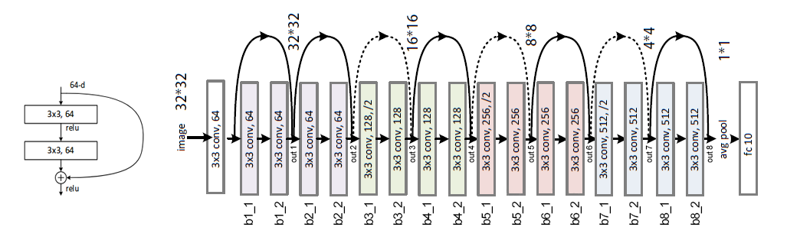

# CIFAR 10 Examples

Some Keras examples over the CIFAR10 dataset

## Example 1

Convolutional network with Batch Norm, Gaussian Noise regularizer and Learning Rate sceduler.

Python code: [here](1_cifar_conv.py)

## Example 2

Data Augmentation is performed to increase virtually the training set using **known** transformations.

Python code: [here](2_cifar_DA.py)

## Example 3

Data Augmentation with more options and feature normalization.

Python code: [here](3_cifar_DA2.py)

## Example 4

Extension of Example 3 using a residual learning framework: [ResNet18](https://arxiv.org/abs/1512.03385).
In the following figure we show the implemented network indicating the different names that we use in the code.

To understand the shortcuts, the residual connection between larger maps with smaller ones, 
what we do is make a 1x1 convolution with stride 2. We can better understand these through the visualization in
the following [link](https://ezyang.github.io/convolution-visualizer/index.html), setting:
+ Input size = 8
+ Kernel size = 1
+ Padding = 0
+ Dilation = 1
+ Stride = 2

These parameters would represent the shortcut that is applied to `out7`. 

Python code: [here](3_cifar_DA2.py)