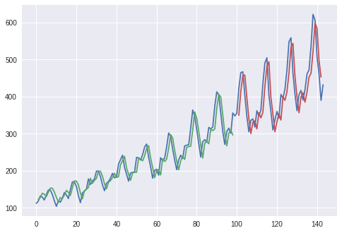

# Time series example

A very basic LSTM example with keras. 

Python Notebook: [here](1_time_series_lstm.ipynb)

Python code: [here](1_time_series_lstm.py)

Some modifications can be done changing the LSTM layer by a SimpleRNN or GRU layers or using larger time steps.

